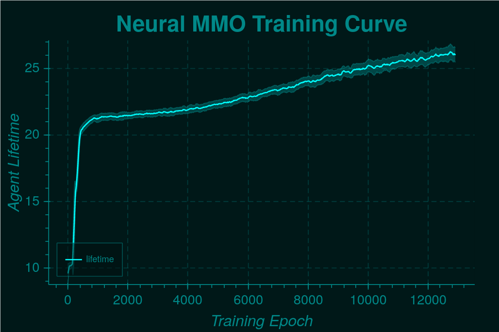
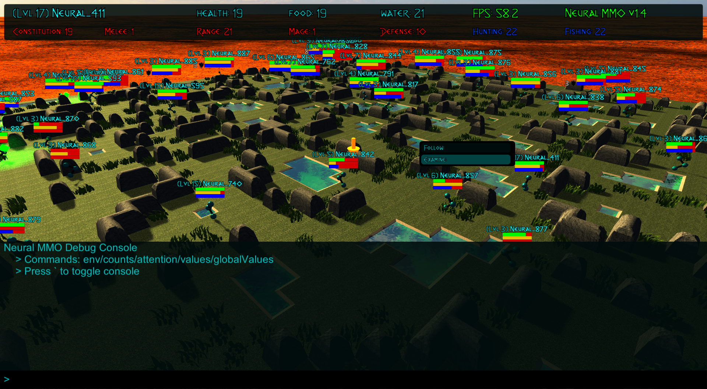
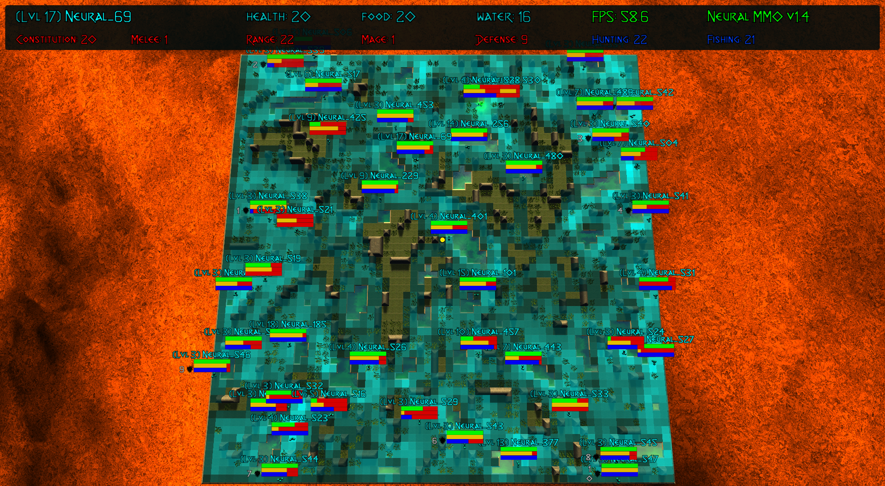
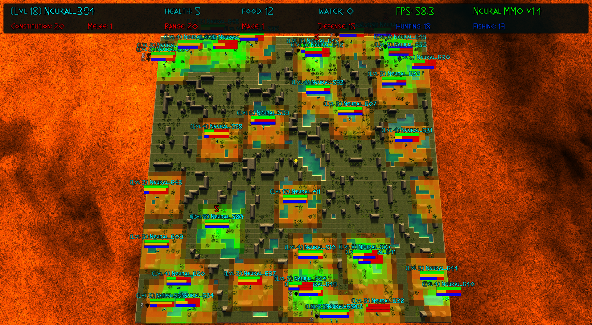
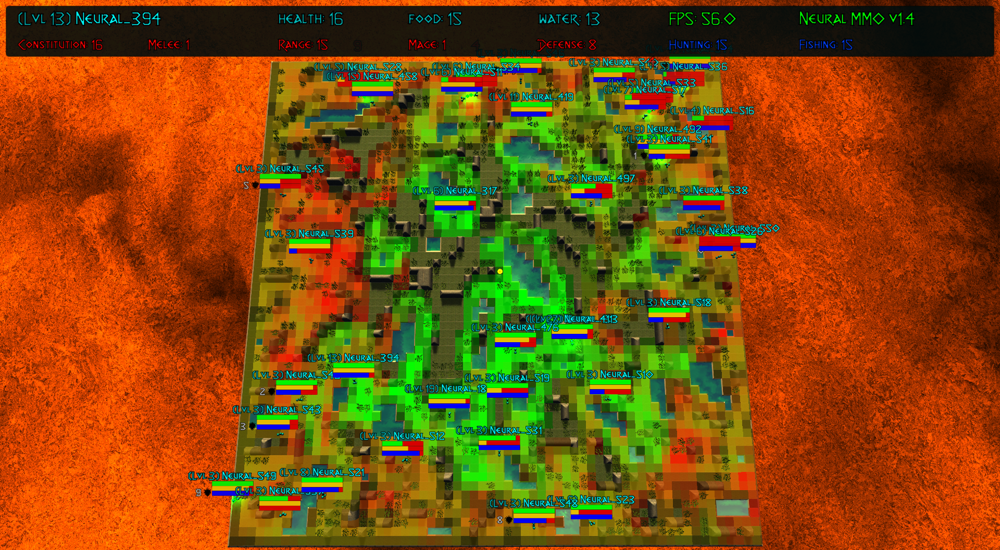
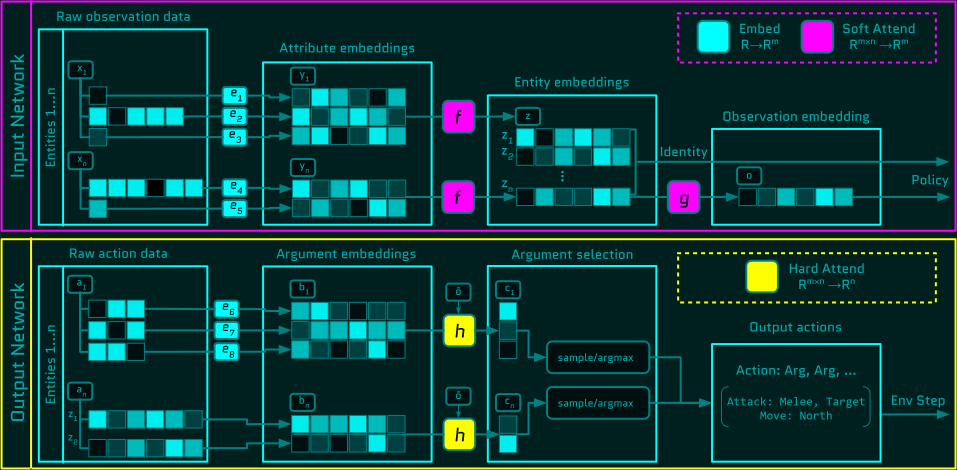
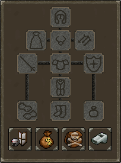

.. |ags| image:: docs/source/resource/ags.png
.. |env| image:: docs/source/resource/v1-4_splash.png

.. |earth| image:: docs/source/resource/earth_thumbnail.png
.. |fire| image:: docs/source/resource/fire_thumbnail.png
.. |water| image:: docs/source/resource/water_thumbnail.png

.. |red| image:: docs/source/resource/neuralRED.png
.. |blue| image:: docs/source/resource/neuralBLUE.png
.. |green| image:: docs/source/resource/neuralGREEN.png
.. |fuchsia| image:: docs/source/resource/neuralFUCHSIA.png
.. |orange| image:: docs/source/resource/neuralORANGE.png
.. |mint| image:: docs/source/resource/neuralMINT.png
.. |purple| image:: docs/source/resource/neuralPURPLE.png
.. |spring| image:: docs/source/resource/neuralSPRING.png
.. |yellow| image:: docs/source/resource/neuralYELLOW.png
.. |cyan| image:: docs/source/resource/neuralCYAN.png
.. |magenta| image:: docs/source/resource/neuralMAGENTA.png
.. |sky| image:: docs/source/resource/neuralSKY.png

|env|
|red| |blue| |green| |fuchsia| |orange| |mint| |purple| |spring| |yellow| |cyan| |magenta| |sky| |red| |blue| |green| |fuchsia| |orange| |mint| |purple| |spring| |yellow| |cyan| |magenta| |sky|

.. #############################################################################################################
.. WARNING: Do NOT edit the overview.rst. That file gets copied from the root README.rst and will be overwritten
.. #############################################################################################################

|ags| Welcome to the Platform!
##############################

Progress in multiagent intelligence research is fundamentally limited by the complexity of environments available for study. Neural MMO `[Demo Video] <https://youtu.be/DkHopV1RSxw>`_ `[Github] <https://github.com/jsuarez5341/neural-mmo>`_ is a massively multiagent AI research environment inspired by Massively Multiplayer Online (MMO) role playing games -- self-contained worlds featuring thousands of agents per persistent macrocosm, diverse skilling systems, local and global economies, complex emergent social structures, and ad-hoc high-stakes single and team based conflict.  Our goal is not to simulate the near-infinite physical processes of life on Earth but instead to construct an efficient facsimile that incentivizes the emergence of high-level social and general artificial intelligence. To this end, we consider MMOs the best proxy for the real world among human games.

**Getting Started:** Neural MMO extends the OpenAI Gym API to support additional environment complexity: persistence, large/variable agent populations, and hierarchical observation/action spaces. The quickest way to dive in is:

**1:** Work through the `[Quickstart Guide] <https://jsuarez5341.github.io/neural-mmo/build/html/overview.html#ags-quickstart>`_ and familiarize yourself with the `[Realm API] <https://jsuarez5341.github.io/neural-mmo/build/html/autodoc/forge.blade.core.realm.html>`_

**2:** Join our `[Discord] <https://discord.gg/BkMmFUC>`_ community for help and discussion. **This is the best way to contact me**

**3:** Develop your own fork and contribute your features to the platform. Neural MMO is fully open-source -- to succeed long-term, we will need the help of talented researchers, software engineers, game designers, and technical artists. I actively review issues and pull requests.

|ags| Overview
##############

**Agents that scale to the complexity of the real world** is one statement of artificial general intelligence. We propose a Dual Subproblem reformulation that cleanly segments this objective into concrete and approachable research and engineering tasks. The project is divided into two research and two engineering modules along these lines -- see `[Ideology] <https://jsuarez5341.github.io/neural-mmo/build/html/overview.html#ags-ideology>`_ if you find this sort of macro view interesting.

Research
--------

**Agents that scale to the complexity of their environment**

|water| Trinity: Distributed computation framework based on Ray+RLlib

|air| Ethyr: Baseline models and research utility contrib -- submit PRs with your own tools!

Engineering
-----------

**Environments that scale to the complexity of the real world**

|earth| Blade: Core game environment and extended OpenAI Gym external API

|fire| Embyr: 3D Unity game client for test-time visualization

|ags| Quickstart
################

The master branch will always contain the latest stable version. Each previous version release is archived in a separate branch. Other branches are for contributors and developers only: they are not bleeding edge builds and may be flammable.

.. code-block:: python
   #Download the Neural MMO environment
   git clone https://github.com/jsuarez5341/neural-mmo && cd neural-mmo

   #Run the setup script.
   python scrips/setup.py 

   #Headless install (e.g. for remote training)
   python scrips/setup.py --NO_SERVER

   #Run the pretrained demo model to test the installation
   python Forge.py

   #Open the client in a separate terminal
   #Server precomputations take ~30 seconds before connecting
   ./client.sh

Maps are procedurally generated by thresholding Perlin ridge fractals. By default, the setup will create 256 of them. The same maps will always be generated in the same order, but you can create as many maps as you like.

.. image:: docs/source/resource/procgen_map.png

|ags| Tutorials
###############

Training from scratch
---------------------

Next, we will get familiar with the baseline parameters and train a model from scratch. Open up projekt/config.py, which contains all of the training configuration options. You can either edit defaults here or override individual parameters using command line arguments. To train a baseline, simply run:

.. code-block:: python

   python Forge.py --LOAD_MODEL=False, --RENDER=False

You can reduce batch size if you are running out of memory or disable CUDA if you don't have a GPU on hand, but performance may suffer. All baseline models train overnight with four i7-9700K CPU cores @3.6 GHz + one GTX 1080Ti at very low utilization and 32 GB of RAM:

As a sanity check, your agents should have learned not to run into lava after a few epochs, around 20 average lifetime. The trained baseline models range with 30-40 average lifetime fully trained. However, individual agents may live much longer -- we have seen >10000 ticks (~100 minutes real-time). Additionally, higher average lifetime is not always strictly better -- the performance of each agent is loosely coupled to the performance of all other agents. Rendering and overlays help resolve discrepancies.

|ags| Rendering and Overlays
############################

Embyr is the Neural MMO renderer. It is written in C# using Unity3D and functions much like an MMO game client: rather than directly simulating game logic, it renders the current game state from packets communicated by the Neural MMO server over a Twisted WebSocket. This design cuts out the overhead of running a bulky game engine during training and also enables us to keep the environment in pure Python for faster development. Embyr is maintained in a separate repository for historical reasons as well as because it is large and not required on remote servers during distributed training. Agents advance various foraging and combat skills by collecting food and water and engaging in fights with other agents:

.. image:: docs/source/resource/v1-4_combat.png

The client ships with an in-game console (press tilde ~ to toggle) stocked with prebuilt overlays for visualizing various aspects of the learned policy. To view an agent's skill levels or follow it with the camera, simply click on it:

The counts overlay renders a heatmap of agent exploration in real time:

The attention overlay renders egocentric heatmaps of each agent's attention weightings in real time:

The values overlay renders a heatmap of the agent's learned value function in real time:

The globalValues overlay hallucinates an agent on each cell and computes the value function for that agent with no other agents on the map and all resources present. This requires a forward pass for each of the ~3600 tiles in the environment. The overlay is precomputed once during server initialization (~30 seconds) and may be disabled in projekt/config.py for faster startup:

.. image:: docs/source/resource/v1-4_globalValues.png

The IO API
----------

OpenAI Gym supports standard definitions for structured, mixed discrete/continuous observation and action (input/output or IO) spaces. However, there are a few issues:

1. OpenAI Gym has a couple of blind spots surrounding dictionary and repeated set observations

2. The existence of structured IO spaces does not imply a corresponding neural architecture for processing them

Neural MMO resolves both of these problems out of the box. We have worked with the RLlib developers to augment OpenAI Gym's *spaces* API with two new structure objects, *Repeated* and *FlexDict*.

Additionally, we have implemented substantially general procedural generation code that automatically fits attentional PyTorch architectures to the given IO spaces. These will be subject to minor tweaks from update to update but should remain structurally stable from update to update. The high-level concept is to model observations of sets of entities, each of which is a set of attributes:

.. image:: docs/source/resource/header.svg

Entity embeddings are created by attending over attributes, and the observation is flattened to a fixed-length embedding by attenting over entity embeddings. Actions are similarly defined by targeting entity embeddings with attention. The diagram below summarizes this process -- see the `[Neural MMO v1.3 white paper] <https://arxiv.org/abs/2001.12004>`_ for details

Our Baseline models include an abstract *Base* model that instantiates our IO modules but defers the hidden network to subclasses:

.. code-block:: python

   class Base(nn.Module):
      def __init__(self, config):
         ...
         self.output = io.Output(config)
         self.input  = io.Input(config,
               embeddings=policy.BiasedInput,
               attributes=policy.Attention)
         self.valueF = nn.Linear(config.HIDDEN, 1)

      def hidden(self, obs, state=None, lens=None):
         raise NotImplementedError('Implement this method in a subclass')

      def forward(self, obs, state=None, lens=None):
         entityLookup  = self.input(obs)
         hidden, state = self.hidden(entityLookup, state, lens)
         self.value    = self.valueF(hidden).squeeze(1)
         actions       = self.output(hidden, entityLookup)
         return actions, state

Custom models work by defining new subnetworks and overriding the *hidden* method. For example:

.. code-block:: python

   class Simple(Base):
      def __init__(self, config):
         '''Simple baseline model with flat subnetworks'''
         super().__init__(config)
         h = config.HIDDEN

         self.conv   = nn.Conv2d(h, h, 3)
         self.pool   = nn.MaxPool2d(2)
         self.fc     = nn.Linear(h*3*3, h)

         self.proj   = nn.Linear(2*h, h)
         self.attend = policy.Attention(self.embed, h)

      def hidden(self, obs, state=None, lens=None):
         #Attentional agent embedding
         agents, _ = self.attend(obs[Stimulus.Entity])

         #Convolutional tile embedding
         tiles     = obs[Stimulus.Tile]
         self.attn = torch.norm(tiles, p=2, dim=-1)

         w      = self.config.WINDOW
         batch  = tiles.size(0)
         hidden = tiles.size(2)
         tiles  = tiles.reshape(batch, w, w, hidden).permute(0, 3, 1, 2)
         tiles  = self.conv(tiles)
         tiles  = self.pool(tiles)
         tiles  = tiles.reshape(batch, -1)
         tiles  = self.fc(tiles)

         hidden = torch.cat((agents, tiles), dim=-1)
         hidden = self.proj(hidden)
         return hidden, state

You can write your own PyTorch models using the same template. Or, if you prefer, you can use our IO subnetworks directly, as is done in our *Base* class. Neural MMO's IO spaces themselves are framework agnostic, but if you want to train in e.g. TensorFlow, you will have to write analogous IO networks.

|ags| Namesake
##############

In formal publications, we refer to our project simply as a (the first) "Neural MMO." Internally and informally, we call it "Projekt: Godsword" (God-Sword). The name comes from two sources: CD Projekt Red, my personal favorite game dev studio, and OldSchool Runescape, which contains an iconic set of weapons called godswords. The latter is a particularly good model for AI environments; the former is more of a soft flavor inspiration.

|ags| Patch Notes + Version History
###################################

The `[OpenAI] <https://github.com/openai/neural-mmo>`_ repository only hosts v1.0. My personal `[Github] <https://github.com/jsuarez5341/neural-mmo>`_ hosts the latest version in *master* and all previous versions as separate branches. This documentation page is generated from the latest environment release. Feel free to drop in the Discord #support channel if you are having trouble. You can expect fast fixes to Github issues and even faster replies to Discord PMs.

**v1.4:** RLlib Support and Overlays | `[Update Slide Deck] <https://docs.google.com/presentation/d/141zRKszdBBEfxmdYWa-QMPmY7uM64trxrF7LBB5OIVg/edit?usp=sharing>`_
   - Blade: Minor API changes have been made for compatibility with Gym and RLlib
      - Environment reset method now returns only obs instead of (obs, rewards, dones, infos)
      - Environment obs and dones are now both dictionaries keyed by agent ids rather than agent game objects
      - The IO modules from v1.3 now delegates batching to the user, e.g. RLlib. As such, several potential sources of error have been removed
      - A bug allowing agents to use melee combat from farther away than intended has been fixed
      - Minor range and damage balancing has been performed across all three combat styles
   - Trinity: This module has been temporarily shelved
      - Core functionality has been ported to RLlib in collaboration with the developers
      - We are working with the RLlib developers to add additional features essential to the long-term scalability of Neural MMO
      - The Trinity/Ascend namespace will likely be revived in later infrastructure expansions. For now, the stability of RLlib makes delegating infrastructure pragmatic to enable us to focus on environment development, baseline models, and research
   - Ethyr: Proper NN building blocks for complex worlds
      - Streamlined IO, memory, and attention modules for use in building PyTorch policies
      - A high-quality pretrained baseline reproducible at the scale of a single desktop
   - Embyr: Overlay shaders for visualizing learned policies
      - Pressing tilde now brings up an in-game console
      - A help menu lists several shader options for visualizing exploration, attention, and learned value functions
      - Shaders are rendered over the environment in real-time with partial transparency
      - It is no longer necessary to start the client and server in a particular order
      - The client no longer needs to be relaunched when the server restarts
      - Agents now turn smoothly towards their direction of movement and targeted adversaries
      - A graphical bug causing some agent attacks to render at ground level has been fixed
      - Moved twistedserver.py into the main neural-mmo repository to better separate client and server
      - Confirmed working on Ubuntu, MacOS, and WSL Linux with a Windows client
   - /projekt: Demo code fully rewritten for RLlib
      - The new demo is much shorter, approximately 400 lines of code
      - State-of-the-art Transformer + LSTM based policy trained with distributed PPO
      - Batched GPU evaluation for real-time rendering
      - Trains in a few hours on a reasonably good desktop (5 rollout worker cores, 1 underutilized GTX 1080Ti GPU)
      - To avoid introducing RLlib into the base environment as a hard dependency, we provide a small wrapper class over Realm using RLlib's environment types
      - Migrated from a pip requirements.txt to Poetry for streamlined dependency management
      - We have migrated configuration to Google Fire for improved command line argument parsing

**v1.3:** Prebuilt IO Libraries | `[Update Slide Deck] <https://docs.google.com/presentation/d/1tqm_Do9ph-duqqAlx3r9lI5Nbfb9yUfNEtXk1Qo4zSw/edit?usp=sharing>`_ :download:`[Paper] <docs/source/resource/nmmo_v1-3.pdf>`
   - Blade: We have improved and streamlined the previously unstable and difficult to use IO libraries and migrated them here. The new API provides framework-agnostic IO.inputs and IO.outputs functions that handle all batching, normalization, serialization. Combined with the prebuilt IO networks in Ethyr, these enable seamless interactions with an otherwise complex structured underlying environment interface. We have made corresponding extensions to the OpenAI Gym API to support variable length actions and arguments, as well as to better signal episode boundaries (e.g. agent deaths). The Quickstart guide has been updated to cover this new functionality as part of the core API.
   - Trinity: Official support for sharding environment observations across multiple remote servers; performance and logging improvements.
   - Ethyr: A Pytorch library for dynamically assembling hierarchical attention networks for processing NMMO IO spaces. We provide a few default attention modules, but users are also free to use their own building blocks -- our library can handle any well defined PyTorch network. We have taken care to separate this PyTorch specific functionality from the core IO libraries in Blade: users should find it straightforward to extend our approach to TensorFlow and other deep learning frameworks.
   - Embyr: Agents now display additional information overhead, such as when they are immune to attacks or when they have been frozen in place.
   - A reasonable 8-population baseline model trained on 12 (old) CPU cores in a day.
   - Improved and expanded official documentation
   - New tutorials covering distributed computation and the IO API
   - The Discord has grown to 80+! Join for active development updates, the quickest support, and community discussions.

**v1.2:** Unity Client and Skilling | `[Update Slide Deck] <https://docs.google.com/presentation/d/1G9fjYS6j8vZMfzCbB90T6ZmdyixTrQJQwZbs8l9HBVo/edit?usp=sharing>`_
   - Blade: Skilling/professions. This persistent progression system comprises Hunting, Fishing (gathering skills) and Constitution, Melee, Range, Mage (combat skills). Skills are improved through usage: agents that spend a lot of time gathering resources will become able to gather and store more resources at a time. Agents that spend a lot of time fighting will be able to inflict and take more damage. Additional bug fixes and enhancements.
   - Trinity: Major new infrastructure API: Ascend -- a generalization of Trinity. Whereas v1.1 Trinity implemented cluster, server, and node layer APIs with persistence, synchronous/asynchronous, etc... Ascend implements a single infrastructure "layer" object with all the same features and more. Trinity is still around and functions identically -- it has just been reimplemented in ~10 lines of Ascend. Additional bug fixes and features; notable: moved environment out of Trinity.
   - Ethyr: Streamlined and simplified IO api. Experience manager classes have been redesigned around v1.2 preferred environment placement, which places the environment server side and only communicates serialized observations and actions -- not full rollouts. Expect further changes in the next update -- IO is the single most technically complex aspect of this project and has the largest impact on performance.
   - Embyr: Focus of this update. Full client rewrite in Unity3D with improved visuals, UI, and controls. The new client makes visualizing policies and tracking down bugs substantially easier. As the environment progresses towards a more complete MMO, development entirely in THREE.js was impractical. This update will also speed up environment development by easing integration into the front end.
   - Baseline model is improved but still weak. This is largely a compute issue. I expect the final model to be relatively efficient to train, but I'm currently low on processing power for running parallel experiments. I'll be regaining cluster access soon.
   - Official documentation has been updated accordingly
   - 20+ people have joined the Discord. I've started posting frequent dev updates and thoughts here.

**v1.1:** Infrastructure and API rework, official documentation and Discord | `[Update Slide Deck] <https://docs.google.com/presentation/d/1EXvluWaaReb2_s5L28dOWqyxf6-fvAbtMcBbaMr-Aow/edit?usp=sharing>`_
   - Blade: Merge Native and VecEnv environment API. New API is closer to Gym
   - Trinity: featherweight CPU + GPU infrastructure built on top of Ray and engineered for maximum flexibility. The differences between Rapid style training, tiered MPI gradient aggregation, and even the v1.0 CPU infrastructure are all minor usage details under Trinity.
   - Ethyr: New IO api makes it easy to interact with the complex input and output spaces of the environment. Also includes a killer rollout manager with inbuilt batching and serialization for communication across hardware.
   - Official github.io documentation and API reference
   - Official Discord
   - End to end training source. There is also a pretrained model, but it's just a weak single population foraging baseline around 2.5x of random reward. I'm currently between cluster access -- once I get my hands on some better hardware, I'll retune hyperparameters for the new demo model.

**v1.0:** Initial OpenAI environment release | `[Blog] <https://openai.com/blog/neural-mmo/>`_ `[Paper] <https://arxiv.org/pdf/1903.00784.pdf>`_
   - Blade: Base environment with foraging and combat
   - Embyr: THREE.js web client
   - Trinity: CPU based distributed training infrastructure
   - Ethyr: Contrib library of research utilities
   - Basic project-level documentation
   - End to end training source and a pretrained model

|ags| Ideology
##############

The dual problem formulation mentioned in the Quickstart guide is core to the guiding ideology of the project. Depending on your own personal conception of where the field is as the moment, this may seem like a practical philosophy, AGI cultism, or anything in between. Regardless, see this `[Two Pager] <https://docs.google.com/document/d/1_76rYTPtPysSh2_cFFz3Mfso-9VL3_tF5ziaIZ8qmS8/edit?usp=sharing>`_ for a more thorough overview of the project approach and objective.

The discussion of failure modes below is mostly intended to dissuade skepticism, which thus far I've found correlates perfectly with lack of familiarity with MMOs. If you are very familiar with MMOs + current AI research and are still skeptical, please contact me on the Discord -- I'd love to hear your views.

|ags| Failure Modes
-------------------

Evaluation can be somewhat difficult in our setting but is not a major blocker. For smaller experiments, we find population size and resource utilization to be reasonable metrics of success. For larger experiments with sufficient domain randomization, Tournaments (as described in the accompanying paper) allow for cross validation of approaches.

We are currently aware of three failure cases for the project:
  * Computational infeasibility
  * "Agents that scale to their environment" is too hard
  * "Environments that scale to the real world" is too hard

The first failure case is a serious risk, but is shared among all areas of the field. This project is not uniquely compute intensive -- in fact, it is one of few environments where it is straightforward to train reasonable policies on a single CPU. If scale is the main issue here, it is likely shared among most if not all other approaches.

The second problem is probably most familiar to researchers as exploration. Given a cold start, how can agents bootstrap both to better policies and to better exploration strategies? This is a hard problem, but it is unlikely to kill the project because:
  * This is independently an important problem that many researchers are already working on already
  * The environment of this project is designed collaboratively to assist agents early on in learning, rather than adversarially as a hard benchmark
  * `[Recent] <https://blog.openai.com/openai-five/>`_ `projects <https://blog.openai.com/learning-dexterity/>`_ have demonstrated success at scale.

The third problem probably appears most likely to many researchers, but least likely to anyone who has spent a significant amount of time in MMOs. Here is a map of the NYC subway:

.. image:: docs/source/resource/quests.png
  :alt: Quest Map
`[Source] <https://www.reddit.com/user/Gamez_X>`_

Actually, it's a quest map of Runescape, a particular MMO that our environment is loosely based upon. Each quest is a puzzle in itself, takes anywhere from several minutes to several hours to complete, is part of an interconnected web of prerequisites of other quests, and provides different incentives for completion ranging from equipment to unlockable content to experience in a tightly connected set of skills:

.. image:: docs/source/resource/skills.png
  :alt: Skills

`[Source] <https://www.jagex.com/en-GB/>`_

In a massive open world:

.. image:: docs/source/resource/map.png
  :alt: GameMap
`[Source] <https://www.jagex.com/en-GB/>`_

The most complex class of games considered to date is MOBAs (Massive Online Battle Arenas, e.g. Dota, Quake CTF), which are round based, take on order of an hour, and are mechanically intensive. Achieving 99 in all skills and acquiring the best gear in Runescape takes, at minimum, several thousand hours. In a tournament setting where attacking other players is allowed everywhere, moment-to-moment gameplay is less important than balancing the risks and rewards of any potential strategy--especially in the presence of hundreds of other players attempting to do the same. There is almost certainly still a complexity gap from MMOs to the real world, but we believe it is much smaller than that in environments currently available.

While our environment is nowhere near the level of complexity of a real MMO yet, it does contain key properties of persistence, population scale, and open-endedness. As agents begin to reach the ceiling of the current environment, we plan on continuing development to raise the ceiling.

|ags| Authorship, License, Disclaimer
#####################################

I, `[Joseph Suarez] <https://github.com/jsuarez5341>`_, am the primary author of Neural MMO. I plan to continue development for at least the duration of my EECS PhD at MIT or until someone convinces me that there is a better way to solve AGI. Everything written in the source and documentation is my own opinion. I do not speak for OpenAI, MIT, Clare, Phillip, Igor, or anyone else involved in the project.

2020 (spring): v1.3 and v1.4 releases
   - Neural MMO v1.3 presented as an Extended Abstract at AAMAS 2020
   - Neural MMO v1.3-prerelease presented at a casual seminar in NeosVR

2019 (fall): Neural MMO development continues at MIT as the main project of my PhD
   - I am continuing my role as the primary developer
   - **Phillip Isola** resumes project oversight as my adviser
   - We are beginning to get open source contributions

2018 (fall): Independent development results in v1.1 and v1.2:
   - I ran the project solo. These versions are derivative works and are MIT sublicensed in my name

2018 (spring): Neural MMO development continues during a 6-month internship at **OpenAI**, culminating in the v1.0 environment (MIT licensed to **OpenAI**) and THREE.js client (MIT licensed to **Joseph Suarez** and **Clare Zhu**) release:
   - I continued my role as the primary developer
   - **Yilun Du** assisted with running experiments and particularly in setting up tournaments for the v1.0 release
   - **Phillip Isola** and **Igor Mordatch** managed and advised the project
   - The v1.0 environment is registered to **OpenAI** and available under the MIT license
   - The legacy THREE.js client was developed independently as a collaboration between myself and **Clare Zhu**. It was originally created as follow-up work for the paper and blog post, but we ended up merging it in. This is also the reason that the project is split into two repositories. It is registered to us jointly and is available under the MIT license

2017 (summer): Neural MMO development begins:
   - I started Neural MMO as an independent side project
   - I (**Joseph Suarez**) retain ownership of this smaller original code base and game kernel, along with associated ideas. I created these before my affiliations with OpenAI and MIT

Open source contributors, listed by time since latest contribution. Discord handle have been used for individuals who have not granted explicit permission to display their real names:
   - **Jack Garbus:** Major contributions to the logging framework, feedback on the documentation and tutorials
   - **@tdimeola:** Feedback on the documentation and tutorials
   - **@cehinson:** Mac build of the Unity3D client

|ags| Assets
############

Some assets used in this project belong to `[Jagex] <https://www.jagex.com/en-GB/>`_, the creators of Runescape, such as

|ags| |earth| |water| |fire| |air|

We currently use them for flavor as an homage to the game that inspired the project. We believe these fall under fair use as a not-for-profit project for the advancement of artificial intelligence research -- however, we are more than happy to remove them upon request. We do own the 2D and 3D files for agents, represented by three neurons.

|red| |blue| |green| |fuchsia| |orange| |mint| |purple| |spring| |yellow| |cyan| |magenta| |sky|
